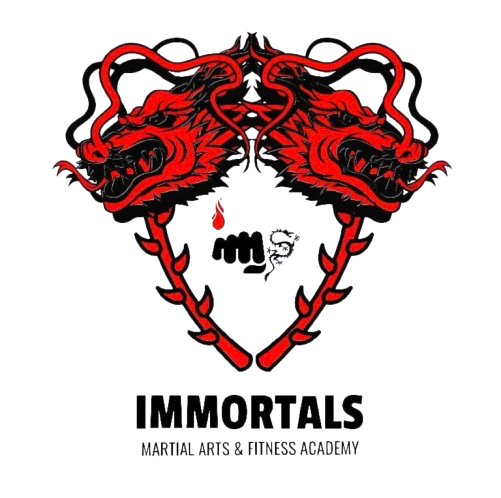

# 🐉 Immortals - Martial Arts & Fitness Academy

Official website repository for **Immortals Martial Arts & Fitness Academy** — Mangaluru's premier combat sports and functional training academy.



> **"Awaken The Warrior Within"**

---

## 🥋 About Immortals Academy

Founded on **January 1, 2021** in Mangaluru, Immortals was created to build combat athletes with a fearless mindset and transform lives through physical strength, technical precision, and discipline.

### 🌟 Key Highlights & Milestones
- 🥇 **14+ Years** of Martial Arts & Combat Coaching Experience
- 🥋 **500+ Students Trained** across academy branches and school programs in Dakshina Kannada & Udupi
- 🏆 **4 National Medalists Built:** Saanvi S Shetty, Aboobakker Hisan, Druvin J, Saanvi P
- 🥇 **50+ State Medalists** across Wushu, Kickboxing, and Muay Thai
- 🎪 **Championship Host:** Hosted 24th State Wushu Championship, Khelo India Wushu Women's State League & 4 District Level Tournaments
- 🏫 **15+ Institutional Partnerships:** Certified fitness & self-defense workshops across educational institutions in DK

---

## 🥊 Leadership & Coaching Staff

- 🥋 **Rohan S** — *Founder & Head Coach*
  - National Wushu Judge & Coach, International Certified Personal Trainer, International Muay Thai & Kickboxing Coach, MMA Master Trainer.
  - South Zone Best Fighter Recipient (Muay Thai), 3 Years Karnataka Team Coach at National Wushu Championship.
- 🥋 **Jayashree D** — *Assistant Head Coach*
  - State Judge & National Player.
- 🥋 **R Daniel** — *Coach*
  - National Judge, State Judge & District Coach.

---

## 🥊 Training Disciplines Offered

- 🥊 **Boxing** — Sharper stance, footwork, combination punching, and fight-ready stamina.
- 🥋 **Kickboxing** — High-intensity striking combining punches and kicks for fat burn and agility.
- 💥 **Muay Thai** — "Art of Eight Limbs" — punches, elbows, knees, and clinch technique.
- 🤼 **MMA (Mixed Martial Arts)** — Striking, takedowns, and ground conditioning for all levels.
- 🥋 **Taekwondo** — Traditional Olympic kicking art (specialized youth & adult batches).
- 🐉 **Kung-Fu** — Form, discipline, flexibility, and martial arts character building.
- 🗡️ **Wushu** — Official Chinese combat sport (Sanda & Taolu forms).
- 🏋️ **Gym & Hybrid Fitness** — Strength, mobility, fat loss, and athletic conditioning.

---

## 📍 Academy Branches & Schedule

1. **Thokkottu (Main Headquarters Branch):** Nethravathi Complex, Door No. 23-22A(6), 2nd Floor, Kapikad, Thokkottu, Ullal, Mangaluru 575020.
   - *Operating Hours:* Monday to Friday — Morning (6:00 AM – 9:00 AM) | Evening (4:00 PM – 10:00 PM)
2. **Urwastore Branch:** Wednesday & Friday (5:30 PM – 7:30 PM)
3. **Kulshekar Branch:** Tuesday & Thursday (2:30 PM – 4:00 PM)
4. **Padavinangady Branch:** Thursday & Saturday (5:00 PM – 6:00 PM)
5. **Educational Institutions:** 15+ Schools & Colleges in DK & Udupi.

---

## 📞 Contact Details

- 📞 **Enquiry Helpline / Call:** `+91 720431 9094`
- 💬 **Direct WhatsApp:** [Chat on WhatsApp (+91 720431 9094)](https://wa.me/917204319094)
- 📸 **Instagram:** [@immortals_academy](https://www.instagram.com/immortals_academy)

---

## 🚀 Quick Start (Local Setup)

Simply open `index.html` in any web browser:

```bash
# Clone repository
git clone https://github.com/vivekjpoojary/Immortals.git

# Navigate to project folder
cd Immortals

# Open website in browser (Mac)
open index.html
```

---

## 📄 License

© Immortals Martial Arts & Fitness Academy. All Rights Reserved.
